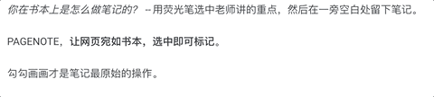

## 关于本项目
在网页里选中内容后、高亮、批注、分享，以及扩展你需要的功能，如反馈，搜索等。



## 使用方式
```javascript
npm install pagenote --save

import Pagenote from 'pagenote';
import 'pagenote/dist/pagenote.css';
var pagenote = new Pagenote('demos',option);
pagenote.init();
```

## 目录
```javascript
-- demos // 存静态的演示页面
-- sdk // PAGENOTE 的核心SDK代码
-- snapshots // 项目 demos 图
```


## 参考资料
[pnpm](https://pnpm.io/zh/cli/install)
